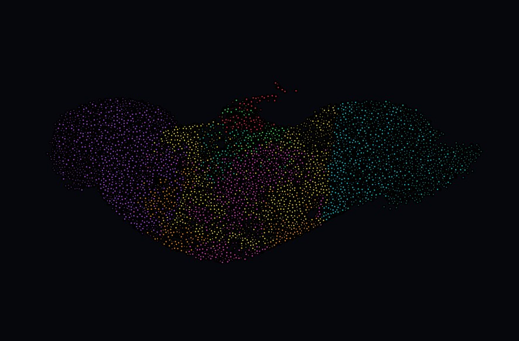
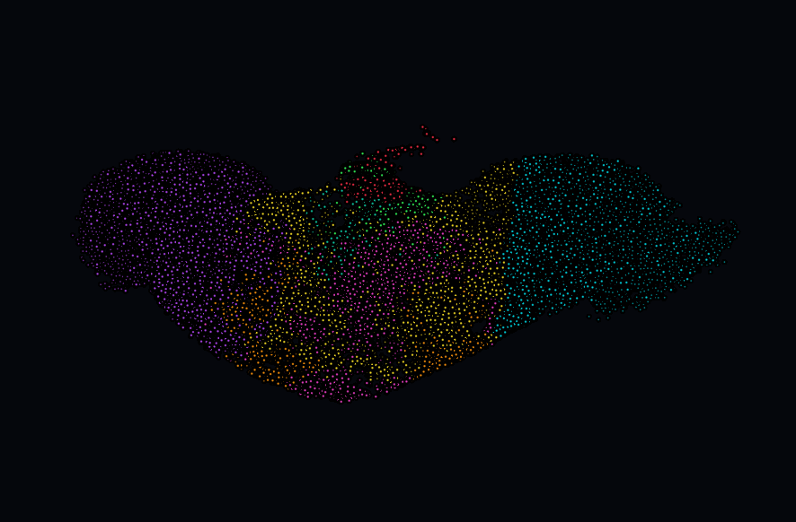

# Fly-LLM: Biological Drosophila Connectome Spiking Neural Network

<p align="center">
  
</p>

An autoregressive Spiking Neural Network (SNN) language model constrained by the authentic 12,288-neuron biological wiring diagram of the *Drosophila melanogaster* connectome (FlyWire FAFB EM dataset), coupled with real-time 3D anatomical spike visualization in VisPy. By fusing empirical electron-microscopy neuroanatomy with surrogate-gradient deep learning, Fly-LLM demonstrates neuromorphic language modeling directly upon genuine invertebrate brain topology.

---

## Key Highlights

- **Authentic EM Neuroanatomy:** Recurrent matrix topology directly derived from the Princeton FlyWire Full Adult Female Brain (FAFB) whole-brain connectome.
- **Strict Biological Adjacency:** 99.59% sparse synaptic graph strictly preserved via hard Hadamard structural masking throughout optimization.
- **Biophysical Dynamics:** Discrete-time Leaky Integrate-and-Fire (LIF) neurons utilizing membrane voltage decay, threshold firing, and reset-by-cancellation.
- **Surrogate Gradient BPTT:** Non-differentiable threshold step bypassed during Backpropagation Through Time (BPTT) using a customized quadratic FastSigmoid surrogate.
- **VRAM-Engineered Optimization:** Chunk-level activation checkpointing and a split optimizer configuration (recurrent raw SGD + feedforward AdamW) maintain peak memory at ~4.7 GB on a single 6 GB GPU.
- **Live 3D Anatomical Renderer:** Multi-threaded VisPy OpenGL visualizer rendering continuous 60 FPS voltage propagation and spike flares across 8 segmented neuropils.

---

## System Architecture

```
                       ┌────────────────────────────────────────┐
                       │           Input Token Stream           │
                       └───────────────────┬────────────────────┘
                                           │
                                           ▼
                       ┌────────────────────────────────────────┐
                       │       Embedding Layer (Vocab=32)       │
                       └───────────────────┬────────────────────┘
                                           │
                                    I_ext  ▼
                       ┌────────────────────────────────────────┐
                       │ Biological Recurrent SNN Core (LIF)    │
                       │                                        │
                       │  • 12,288 Neurons (FAFB EM Subgraph)   │
                       │  • 619,986 Synapses (99.59% Sparse)    │
                       │  • W_eff = W_rec ⊙ Bio_Mask            │
                       │  • Leak λ = 0.88, V_th = 1.0           │
                       │  • FastSigmoid Surrogate Gradient      │
                       └───────────┬────────────────┬───────────┘
                                   │                │
                        Spikes S_t │                │ Spikes S_t (Queue)
                                   ▼                ▼
         ┌─────────────────────────────────┐   ┌───────────────────────────────┐
         │ Readout Head (GELU + MLP)       │   │ VisPy 3D OpenGL Visualizer    │
         │                                 │   │                               │
         │ Linear(12288 -> 512) -> GELU    │   │ • 3D EM Coordinates (nm)      │
         │ -> Linear(512 -> 32)            │   │ • 8 Neuropil Partitions       │
         │                                 │   │ • 60 FPS Decay & Flare Loop   │
         └─────────────────┬───────────────┘   └───────────────────────────────┘
                           │
                           ▼
         ┌─────────────────────────────────┐
         │ Autoregressive Next-Char Logits │
         └─────────────────────────────────┘
```

---

## Core Architecture & Engineering

### 1. Biological Connectome Recurrence
The recurrent layer is initialized from the Princeton FlyWire FAFB electron microscopy connectome dataset (`fly_connectome_csr.npz`). From the complete whole-brain graph (>130,000 neurons), a 12,288-neuron sub-circuit is extracted based on total degree centrality ($k_i = k_i^{\text{in}} + k_i^{\text{out}}$):

$$k_i = \sum_{j} A_{ji} + \sum_{j} A_{ij}$$

The resulting sub-network encapsulates **12,288 biological neurons** interconnected by **619,986 directed synapses**, achieving a structural density of **0.41%** (99.59% sparse). Initial synaptic weights are normalized and scaled to bound the spectral radius:

$$W_{\text{init}} = \text{clamp}\left(\frac{A_{\text{sub}}}{25.0}, 0.0, 1.2\right)$$

### 2. Synaptic Topology Masking
To prevent gradient updates from generating artificial non-biological connections, structural topology is strictly maintained using a static binary adjacency mask $M_{\text{bio}} \in \{0, 1\}^{N \times N}$. The effective recurrent transmission is evaluated as:

$$W_{\text{eff}} = W_{\text{rec}} \odot M_{\text{bio}}$$

After each optimizer update step, non-biological weight drift is eliminated in-place:

```python
with torch.no_grad():
    model.w_rec.data.masked_fill_(~model.mask, 0.0)
```

No connection outside the authentic biological connectome can form at any point during training.

### 3. Leaky Integrate-and-Fire (LIF) Dynamics
Neuron states evolve according to discrete-time Leaky Integrate-and-Fire equations evaluated across character time-steps $t$:

$$V[t] = V[t-1] \cdot \lambda \cdot (1 - S[t-1]) + S[t-1] W_{\text{eff}}^T + I_{\text{ext}}[t]$$

$$S[t] = \Theta(V[t] - V_{\text{th}})$$

Where:
- $V[t] \in \mathbb{R}^{B \times N}$ is the sub-threshold membrane potential vector.
- $S[t] \in \{0, 1\}^{B \times N}$ is the binary spike emission vector.
- $\lambda = 0.88$ is the membrane potential decay factor (exponential leak).
- $V_{\text{th}} = 1.0$ is the firing threshold.
- $(1 - S[t-1])$ enforces an immediate hard reset to baseline upon spiking.
- $I_{\text{ext}}[t] \in \mathbb{R}^{B \times N}$ represents input current injected via character embedding vectors.

### 4. FastSigmoid Surrogate Gradient
The Heaviside step function $\Theta(x)$ possesses zero derivative almost everywhere and is undefined at $x = 0$, halting backward error propagation in standard BPTT. Fly-LLM integrates a quadratic FastSigmoid surrogate gradient during the backward pass:

$$\text{Forward:} \quad S = \Theta(V - V_{\text{th}})$$

$$\text{Backward:} \quad \frac{\partial S}{\partial V} = \frac{1}{\left(10.0 \cdot |V - V_{\text{th}}| + 1.0\right)^2}$$

This surrogate provides a smooth, bell-shaped derivative centered at the firing threshold, allowing stable gradient flow back across extended temporal sequences while executing hard binary spiking on the forward pass.

### 5. Memory & Compute Optimization

Training a 12,288-neuron recurrent model across sequence lengths of 96 requires targeted memory engineering to prevent GPU VRAM exhaustion:

- **Activation Checkpointing:** PyTorch activation checkpointing (`torch.utils.checkpoint.checkpoint`) is wrapped around discrete temporal chunks (`chunk_size = 16`). Intermediate forward activations for BPTT are recomputed during the backward pass, reducing peak activation memory from $O(T)$ to $O(\text{chunk})$.
- **Split Optimizer Architecture:**
  - A dense $12,288 \times 12,288$ parameter matrix consumes ~604 MB of FP32 memory. Standard adaptive optimizers (e.g., AdamW) allocate two tracking states per parameter (first and second moments), requiring an additional **~1.21 GB of GPU VRAM** exclusively for recurrent optimizer states.
  - Fly-LLM utilizes a dual optimizer strategy:
    - **Raw SGD** (`optimizer_rec`) optimizes $W_{\text{rec}}$ with **zero extra momentum states**.
    - **AdamW** (`optimizer_dense`) optimizes the token embeddings and MLP readout layers.
  - **Memory Impact:** Total training footprint stabilizes at **~4.7 GB VRAM**, enabling full BPTT training on standard 6 GB consumer/laptop GPUs (e.g., NVIDIA RTX 3060 Laptop).

---

## Real-Time 3D Anatomical Visualizer

`fly_live_visualizer.py` couples the trained SNN to a real-time 3D OpenGL viewport powered by VisPy:

<p align="center">
  
</p>

- **True Electron Microscopy Coordinates:** Neuron positions are mapped from physical FAFB coordinates (`coordinates.csv.gz`). Axial voxel anisotropy (40 nm in Z vs. 4 nm in XY) is compensated via a $10\times$ axial scaling correction prior to scene normalization.
- **Dynamic Neuropil Segmentation:** Neurons are classified into 8 primary functional compartments using coordinate bounding volumes and anatomical neuropil identifiers:

| Compartment | Anatomical Regions | Color Code | Hex Code |
| :--- | :--- | :---: | :---: |
| **Central Complex (CX)** | Fan-shaped body (FB), Ellipsoid body (EB), Protocerebral bridge (PB), Noduli (NO) | Neon Green | `#33FA59` |
| **Left Optic Lobe** | Medulla (ME_L), Lobula (LO_L), Lobula plate (LOP_L) | Electric Cyan | `#00D9E6` |
| **Right Optic Lobe** | Medulla (ME_R), Lobula (LO_R), Lobula plate (LOP_R) | Vivid Violet | `#B847FA` |
| **Mushroom Body (MB)** | Kenyon cells (KC), Calyx (CA), Pedunculus (PED) | Vibrant Amber | `#FF940D` |
| **Antennal Lobes (AL)** | Primary olfactory glomeruli | Crimson / Coral | `#FA2E47` |
| **Gnathal Ganglion / SEZ** | Subesophageal zone, mechanosensory, feeding motor center | Teal | `#0DCCB2` |
| **Superior Protocerebrum** | SMP, SLP, SIP higher integration centers | Hot Magenta | `#F240CC` |
| **Lateral Horn (LH)** | LH, AVLP, PVLP innate olfactory appraisal | Gold | `#FAE026` |

- **Anatomical Ghost Hull:** A semi-transparent background point cloud of 28,000 sampled Drosophila neurons (`alpha = 0.08, size = 2.0`) outlines the physical brain boundary.
- **Thread-Safe Spike Event Pipeline:** Autoregressive character generation runs in an independent daemon worker thread. Binary spike states $S_t \in \{0, 1\}^N$ are pushed into a thread-safe `queue.Queue`.
- **60 FPS Flare & Decay Loop:** The VisPy OpenGL timer continuously drains spike events, updating neuron sizes ($2.5 \rightarrow 10.0\text{ px}$) and interpolating colors from baseline neuropil hues to bright white incandescent flashes (`[1.0, 1.0, 1.0]`) with exponential activity decay ($\tau = 0.85$).

---

## Repository Structure

```
fly-llm/
├── assets/
│   ├── brain_visualizer.jpg    # Primary hero thumbnail of the 3D visualizer
│   └── brain_visualizer.png    # High-resolution visualizer render
├── coordinates.csv.gz          # EM physical spatial coordinates for Drosophila neurons
├── corpus.txt                  # Preprocessed training text corpus
├── fly_connectome_csr.npz      # Compressed CSR adjacency matrix of the connectome
├── fly_live_visualizer.py      # VisPy-based real-time 3D anatomical spike visualizer
├── fly_llm.py                  # Main SNN training and autoregressive generation engine
├── fly_3d_viewer.py            # Spectral embedding / Laplacian eigenmaps fallback viewer
├── get_corpus.py               # Text corpus retrieval and character sanitization utility
├── preprocess_connectome.py    # Pipeline converting raw synaptic CSV into compressed CSR
└── README.md                   # System documentation and architecture guide
```

---

## Getting Started & Execution

### 1. Prerequisites & Environment Setup

A CUDA-compatible GPU is required for model training. Ensure NVIDIA drivers and CUDA Toolkit are installed.

```bash
# Clone the repository
git clone https://github.com/uzzambutt/fly-llm.git
cd fly-llm

# Create a virtual environment
python -m venv fly_env

# Activate environment (Windows PowerShell)
.\fly_env\Scripts\Activate.ps1

# Activate environment (Linux/macOS)
# source fly_env/bin/activate

# Install dependencies
pip install torch torchvision --index-url https://download.pytorch.org/whl/cu121
pip install vispy PyQt6 numpy scipy polars
```

### 2. Corpus Preprocessing (Optional)

If `corpus.txt` is not present or you wish to download an alternate training set:

```bash
python get_corpus.py
```
*Select from pre-configured public-domain corpora (e.g., The War of the Worlds, Frankenstein, The Time Machine, or Tiny Shakespeare). Text is sanitized to a 32-character vocabulary (`a-z`, space, and punctuation `.,!?-`).*

### 3. Training the Spiking Neural Network

Run the main training script:

```bash
python fly_llm.py
```

- **Interactive CLI Prompts:**
  - Select mode: `[1]` Continue training from checkpoint, `[2]` Start new session, or `[3]` Inference only.
  - Set neuron count (default: `12288`).
  - Set number of training epochs (default: `500`).
- **Telemetry Display:**
  Reports active Loss, Peak VRAM (MB), and processing speed (sec/epoch). Checkpoints are autosaved every 50 epochs to `fly_brain_checkpoint.pt`.
- **Interactive Generation:**
  Once training concludes (or in Mode 3), enter text prompts directly in the console for autoregressive generation.

### 4. Running the Real-Time 3D Anatomical Visualizer

Launch the interactive 3D VisPy renderer:

```bash
python fly_live_visualizer.py
```

- An interactive OpenGL window opens displaying the 3D Drosophila brain oriented in turntable mode.
- In the terminal prompt, type any sentence or seed word and press **Enter**.
- Observe character-by-character generation while active biological sub-circuits fire and decay in real time across the 3D anatomical neuropils.

---

## Technical Specifications

| Parameter | Value | Description |
| :--- | :--- | :--- |
| **Neuron Count ($N$)** | 12,288 | High-degree biological neurons from FAFB dataset |
| **Synapse Count ($M$)** | 619,986 | Directed biological synaptic connections |
| **Graph Density** | 0.41% | 99.59% structural sparsity |
| **Membrane Leak ($\lambda$)** | 0.88 | Discrete exponential decay factor |
| **Threshold ($V_{\text{th}}$)** | 1.0 | Discrete spiking voltage threshold |
| **Surrogate Function** | FastSigmoid | Quadratic derivative surrogate for BPTT |
| **Sequence Length ($T$)** | 96 chars | Temporal context window per training step |
| **Chunk Size** | 16 steps | Activation checkpointing interval |
| **Batch Size** | 32 | Sequences per optimization step |
| **Peak Training VRAM** | ~4.7 GB | Measured on NVIDIA RTX 3060 Laptop GPU |
| **Rendering Pipeline** | VisPy / OpenGL | 60 FPS update timer with turntable camera |

---

## Citation & Connectome Data Attribution

Connectome data utilized in Fly-LLM is derived from the Princeton FlyWire Consortium and the Janelia Research Campus FlyEM Project:

- **FlyWire Connectome:** Dorkenwald et al., *"Neuronal wiring diagram of an adult brain,"* Nature (2024). [FlyWire FAFB Data](https://flywire.ai/).
- **FAFB Full Adult Female Brain EM:** Zheng et al., *"A Complete Electron Microscopy Volume of the Brain of Adult Drosophila melanogaster,"* Cell (2018).

---

## License

This project is licensed under the MIT License.